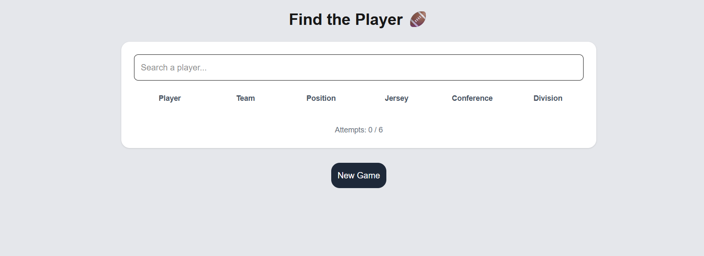
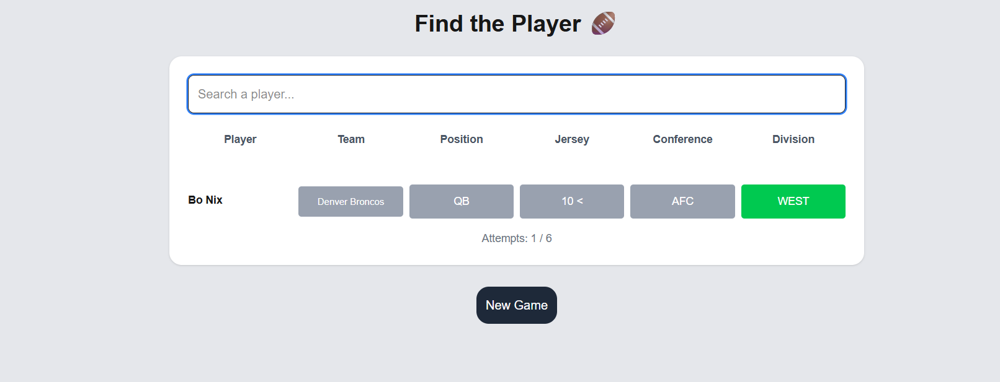
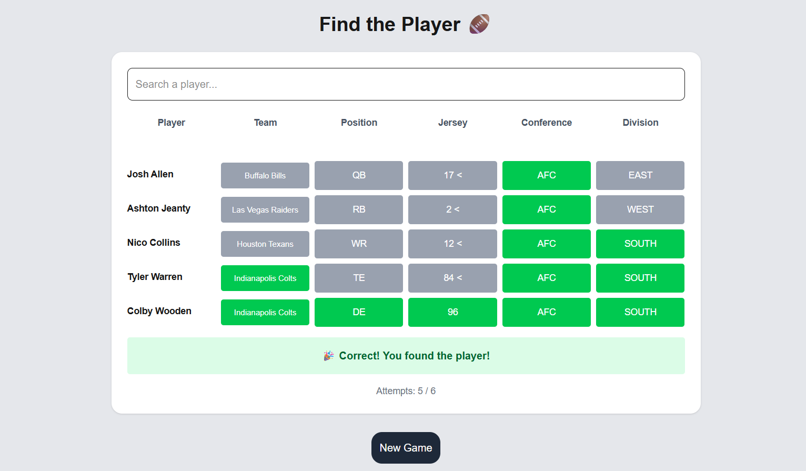
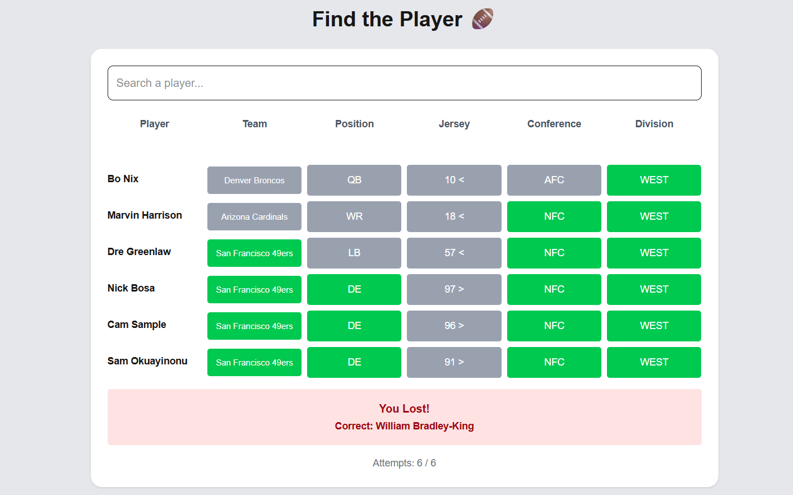

# 🏈 NFL Wordle

A fullstack Wordle-style game where users guess an NFL player based on clues like team, position, jersey number, conference and division.

---

## 🚀 Live Demo

* Frontend: [https://findfootballplayer.vercel.app](https://findfootballplayer.vercel.app)
* Backend API: [https://findfootballplayer.up.railway.app](https://findfootballplayer.up.railway.app)

---

## 🎯 Features

* 🔍 Player search with autocomplete
* 🎮 Wordle-style guessing mechanics
* 📊 Hint system (correct, close, wrong)
* ⚡ Keyboard navigation (↑ ↓ Enter)
* 🛡 Rate limiting & security middleware
* 🧪 Automated tests (Jest + Supertest)

---

## 🧱 Tech Stack

### Backend

* Node.js
* Express
* Prisma ORM
* PostgreSQL

### Frontend

* Next.js
* React
* Tailwind CSS

### DevOps

* Railway (Backend + DB)
* Vercel (Frontend)

---

## 🧠 How It Works

1. A random player is selected as the secret.
2. The user makes guesses via autocomplete search.
3. The backend compares attributes:

   * Team
   * Position
   * Jersey number
   * Team Conference
   * Team Division
     
4. Hints are returned:

   * 🟢 Correct
   * 🟡 Higher / Lower
   * ⚫ Wrong
5. Score is calculated based on attempts.

---

## 📦 Installation (Local)

### 1. Clone repo

```bash
git clone https://github.com/AlfredolMacias/findFootballPlayer.git
```

### 2. Backend setup

```bash
cd backend
npm install
```

Create `.env`:

```env
DATABASE_URL=postgresql://...
```

Run migrations:

```bash
npx prisma migrate dev
```

Start server:

```bash
npm run dev
```

---

### 3. Frontend setup

```bash
cd frontend
npm install
```

Create `.env.local`:

```env
NEXT_PUBLIC_API_URL=http://localhost:3000
```

Run:

```bash
npm run dev
```

---

## 🧪 Running Tests

```bash
npm test
```

---

## 📁 Project Structure

```
src/
 ├── controllers
 ├── services
 ├── routes
 ├── validations
 ├── middleware
 ├── utils
 ├── lib
```

---

## 🧠 What I Learned

* Designing REST APIs
* Database modeling with Prisma
* Building interactive UI with React
* Implementing game logic
* Writing automated tests
* Deploying fullstack apps

---

## 📸 Screenshots






---

## 🔮 Future Improvements

* User authentication
* Global rankings
* More sports (NBA, Soccer)
* Dark mode
* Animations

---

## 👤 Author

Alfredo Loeza Macias [www.linkedin.com/in/alfredo-loeza-macias]


---

## ⭐ If you like this project

Give it a star on GitHub!
